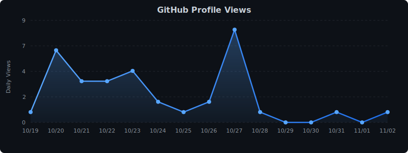

<h2 align="center">Hey There! </h2>

<!-- ### :man_technologist: &nbsp;About Me : --->

I am a Backend and DevOps Developer!

- 🎓 I am currently persuing my 2nd Master's degree in Information Systems at Uppsala University.
- 🔭 I’m working as a Software Engineer and contributing to the Backend and DevOps parts for building applications.
- 🌱 Training to become a Product Enginner. Currently learning [][tech_tools_anchor].
- ⚡ In my free time I go on adventures and post videos on   about my adventures.
- 🔗 Feel free to connect with me on .
<!-- - 🥅 2023 Goals: Contribute to any one Open Source project -->

<!--
### 🛠 &nbsp;Languages and Tools :

[][tech_tools_anchor]
&nbsp;
[][tech_tools_anchor]
&nbsp;
[][tech_tools_anchor]
&nbsp;
[][learning_next_anchor]
&nbsp;
[][tech_tools_anchor]
&nbsp;
[][tech_tools_anchor]
&nbsp;
[][tech_tools_anchor]
&nbsp;
[][tech_tools_anchor]
&nbsp;
[][tech_tools_anchor]
&nbsp;
[][tech_tools_anchor]
&nbsp;
[][tech_tools_anchor]
&nbsp;
[][tech_tools_anchor]
&nbsp;
[][tech_tools_anchor]
&nbsp;
[][tech_tools_anchor]
&nbsp;

---
-->
### 🔥 &nbsp; <a href="https://github.com/vatsalunadkat"> My Stats: </a>
 &nbsp;

### ᗧ···ᗣ···ᗣ·· &nbsp; <a href="https://github.com/vatsalunadkat"> Live Contributions Graph Pac-man: </a>
<picture>
  <source media="(prefers-color-scheme: dark)" srcset="https://raw.githubusercontent.com/vatsalunadkat/vatsalunadkat/output/pacman-contribution-graph-dark.svg">
  <source media="(prefers-color-scheme: light)" srcset="https://raw.githubusercontent.com/vatsalunadkat/vatsalunadkat/output/pacman-contribution-graph.svg">
  
</picture>

### (TESTING) Recent Activity
   

<!-- 

 -->
 
<!--  -->

<!--  -->
<!--
---

### ✍️ Blog Posts (Outdated):

<a target="_blank" href="https://medium.com/@vatsalunadkat/comparing-arm-architecture-version-armv1-to-armv7-acfad715e6f2"></img></a>
<a target="_blank" href="https://medium.com/@vatsalunadkat/my-data-science-project-blog-467e6cc316ad"></img></a>
<a target="_blank" href="https://medium.com/@vatsalunadkat/learning-ai-9ba2b0454e93"></img></a>

---

### 🔗 Connect with me:

-->

[tech_tools_anchor]: #top
[learning_now_anchor]: #top
[learning_next_anchor]: #top

